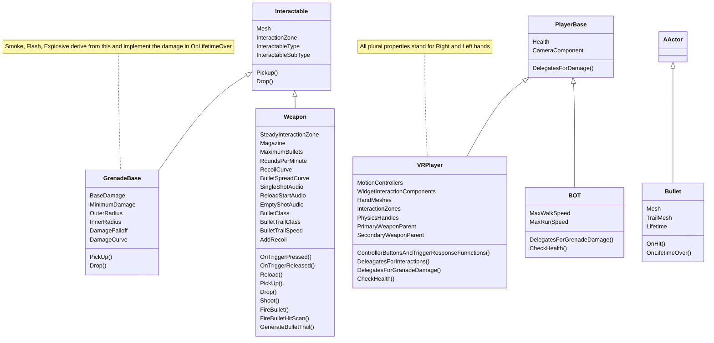

# First Person Shooter

Work in progress source code for a virtual reality based first person shooter, with features similar to Counter Strike.

## Gameplay Class Diagram.

## Points
* Weapons recoil differently when held with one and hand or two, with two hands providing more stability than one hand.
* The recoil of the gun is physics based and driven by a recoil curve. This curve is in effect when firing in full automatic mode i.e. recoil amount generally increases as more shots are fired before the 'cool down' period is over, which is the case in full automatic mode.
* The recoil is implemented using the Physics Handle component and 'cool down' period is the time it takes for the physics handle to reach the 'initial position'.
* Bullet spread is controlled by the bullet spread curve, which generally increases as more bullets are shot in full automatic mode.